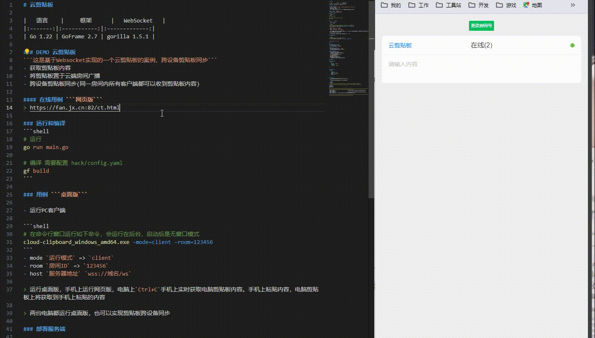

# 云剪贴板

|   语言    |     框架      |   WebSocket   |
|:-------:|:-----------:|:-------------:|
| Go 1.22 | GoFrame 2.7 | gorilla 1.5.1 |

### DEMO 云剪贴板
```这是基于Websocket实现的一个云剪贴板的案例，跨设备剪贴板同步```
- 获取剪贴板内容
- 将剪贴板置于云端房间广播
- 跨设备剪贴板同步(同一房间内所有客户端都可以收到剪贴板内容)

#### 在线用例 ```网页版```
> https://fan.jx.cn:82/ct.html

### 运行和编译
```shell
# 运行
go run main.go

# 编译 需要配置 hack/config.yaml
gf build
```

### 用例 ```桌面版```

- 运行PC客户端

```shell
# 在命令行窗口运行如下命令，会运行在后台，启动后是无窗口模式
cloud-clipboard_windows_amd64.exe -mode=client -room=123456
```
- mode `运行模式` => `client`
- room `房间ID` => `123456`
- host `服务器地址` `wss://域名/ws` 

> 运行桌面版，手机上运行网页版，电脑上`Ctrl+C`手机上实时获取电脑剪贴板内容。手机上粘贴内容，电脑剪贴板上将获取到手机上粘贴的内容

> 两台电脑都运行桌面版，也可以实现剪贴板跨设备同步



### 部署服务端

```shell
# 端口默认:5123, mode不传默认为服务端
./cloud-clipboard_linux_amd64 -port=5123 -mode=server
```

- port `端口` => `5123`

### 开发

#### WebSocket 底层封装
- utility/client ``客户端``
- utility/websocket ``服务端``

#### WebSocket 业务层
- internal/packed/client ``客户端``
- internal/packed/websocket ``服务端``

### 已实现的功能
- 仿http路由与路由组写法
- 路由支持链式调用与路由组层级嵌套
- 路由/组与中间件实现
- 通过中间件可实现消息限流(选)
- Action绑定到控制器
- 群聊与私聊，上下线通知
- 支持单点登录被迫下线(选)
- 异常处理，隐式ping，客户端自动重连等

### 消息格式

#### 请求体格式
```json
{
    "action": "login",
    "data":{
      "token": "xxxxx",
    }
}
```

#### 响应体格式
```json
{
    "code": 0,
    "action": "login",
    "msg": "success",  
    "data":{}
}
```

### 打印路由
- 使用下面方法可打印服务端的 websocket 的路由
```go
_ = websocket.GetSocketServer().PrintRoute()
```
- 打印结果
```text
|----------------------------------------------------------------- route -----------------------------------------------------------------------------|
| Action                                   | Controller                                                   | Middleware                                |
|-----------------------------------------------------------------------------------------------------------------------------------------------------|
| get_content                              | cloud-clipboard/internal/packed/socket/app.(*App).GetContent |                                           |
| set_content                              | cloud-clipboard/internal/packed/socket/app.(*App).SetContent | cloud-clipboard/internal/middleware.Limit |
|-----------------------------------------------------------------------------------------------------------------------------------------------------|
```